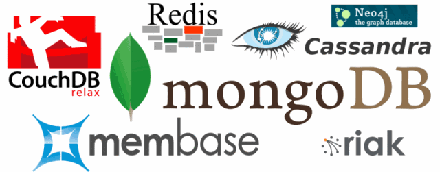
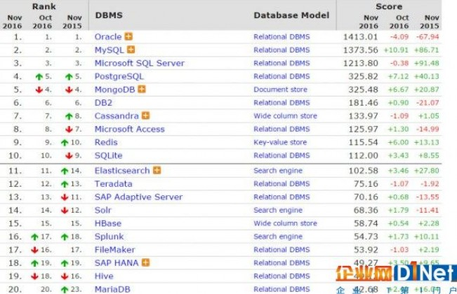

## NoSQL概念(了解)
> NOSQL概念在09年被提出来，NoSQL最常见的解释是"non-relational",也就是非关系，Not Only SQL也被很多人接收。

> NoSQL现在一般理解成非关系型数据库

## NoSQL的优势(了解)

 1. 易扩展
 	
	NoSQL去掉了关系数据库的关系型特性，数据之间没有关系。这样就非常容易扩展。

 2. 大数据量，高性能
 
	NoSQL数据库都具有非常高的读写性能，在数据量很大下，同样表现优秀。

 3. 灵活的数据模型

     NoSQL无需事先为要存储的数据建立字段，随时可以存储自定义的数据格式。而在关系数据库里，增删字段是一件非常麻烦的事情。如果是非常大数据量的表，增加字段简直就是一个噩梦。

### 总结

   MySQL和NoSQL都有各自的特点和使用的应用场景，两者的紧密结合将会给web2.0的数据库发展带来新的思路。**让关系数据库关注在关系上，NoSQL关注在存储上。**

## 常见的NoSQL产品

2016年数据排名情况

## Redis

1.  Redis 是一个开源的，内存中的数据结构存储系统，它可以用作数据库、缓存和消息中间件。 它支持多种类型的数据结构，如 **字符串（strings）， 散列（hashes）， 列表（lists）， 集合（sets）， 有序集合（sorted sets)**等数据类型。

2.  Redis数据都是缓存在内存中。redis会周期性的把更新的数据写入硬盘或者把修改操作写入追加到记录文件

