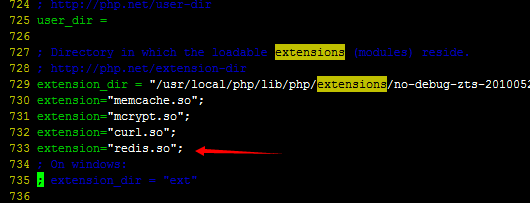
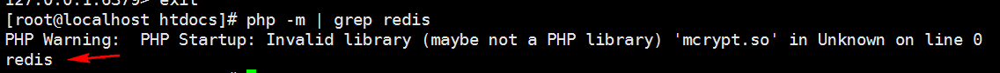

## PHP操作Redis扩展安装

> PHP操作Redis常用的扩展有phpredis,predis。前者是C语言编写，predis是PHP编写的。

1. phpredis

    速度相对快，但是需要编译安装

2. predis

    速度相对phpredis慢，但是不需要编译安装，直接将predis放到项目目录即可

## phpredis安装步骤

   1. 下载

		# wget https://github.com/nicolasff/phpredis/archive/master.tar.gz
  
       或者使用window系统下载好，然后使用winscp软件上传到centos系统

   2. 解压

      	tar -zxvf phpredis-master.tar.gz

   3. 将phpredis移到到php的扩展目录

        mv phpredis-master /usr/local/php/include/php/ext/phpredis

		注意：你的环境php的拓展目录不一定是/usr/local/php/include/php/ext/ ，请根据你的环境修改

   4. 编译phpredis

        cd /usr/local/php/include/php/ext/phpredis

		/usr/local/php/bin/phpize 

		./configure  --with-php-config=/usr/local/php/bin/php-config

		make && make install

   5. 修改php.ini,让php加载phpredis扩展
   
		vim /usr/local/php/etc/php.ini   #路径根据具体地环境而定

	    在php.ini加入extension="redis.so"; 

      

   6. 重启apache服务器

      	/usr/local/apache2/bin/apachectl stop

		/usr/local/apache2/bin/apachectl start

   7. 检查是否有redis扩展

		# php -m | grep redis
	
		 当输出redis，就说明redis扩展安装成功了

	

   8. 测试例子

       在apache的根目录写一个demo.php

			<?php
			   $redis = new Redis();
			   $redis->connect(‘127.0.0.1’,6379);
			
			   $redis->set(‘name’,’test’);
			   var_dump($redis->get(‘name’));//如果输出test,说明成功
			?>

  

