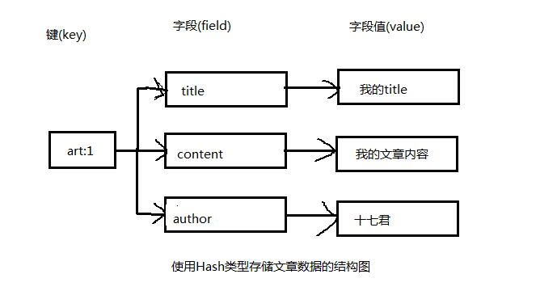

h## Redis的常用命令

每种不同的数据类型对应不同的命令，并且不同类型的命令不能互相操作，也就是说字符串类型的命令不能其他类型的数据。

### 字符串类型常用命令

  String是最基本的数据类型，一个键(Key)对应一个值(Value)。
它能存储任何形式的字符串，包括二进制数据。你可以用String存储用户的邮箱、图片等。一个字符串类型允许存储的数据的最大容量是512MB。

   1. set 键名  值
   2. get 键名
   3. setnx 键名 值
       当键名不存在时，设置成功，否则失败

   4. setex 键名 时间   值

        时间单位为s

        例子：  setex name 5  jack

        name键只存在5s

   5. 一次设置多个键
     
      	mset key value [key value ...]
       

       例子：

		127.0.0.1:6379> mset  name  jack   name1   mary

    6. 一次读取多个键的值

       		mget key [key ...]

        	127.0.0.1:6379> mget name name1

    7. 将 key 中储存的数字值增一

 			INCR key

    8. 将 key 所储存的值加上增量 increment

			INCRBY key increment
	
			127.0.0.1:6379> incr num
			(integer) 1
			127.0.0.1:6379> incrby num  8
			(integer) 9

    9. 将 key 中储存的数字值减一

        	DECR key

    10. 将 key 所储存的值减去减量 decrement

			DECRBY key decrement

    11. 给key的键值尾部添加值
		
			append key value

    12.  获取key值的长度

			strlen key

更多命令请参考： http://redisdoc.com/

## Hash（哈希表）类型常用命令

1. Redis的hash类型是一个string类型的field和value的映
射表。

2. Hash特别适合用于存储对象。相对于将对象的每个属性存成单个string类型。

3. 将一个对象存储在Hash类型中会占用更少的内存，并且可以更方便地存取整个对象。

   1. 将哈希表 key 中的field 的值设为 value

       HSET  key field value

       例子：  hset mm  height  175cm

   2. 返回哈希表 key 中给定 field 的值

		hget key field

       例子：  hget mm height  //可以得到175cm

   3. 将哈希表 key 中的 field 的值设置为 value ，当且仅当字段 field 不存在

		HSETNX key field value

   4. 同时将多个 field-value (键值)对设置到哈希表 key 中

		HMSET key field value [field value ...]

   5. 返回哈希表 key 中，一个或多个给定字段的值

		HMGET key field [field ...]

   6. 为哈希表 key 中的字段 field 的值加上增量 increment

       	HINCRBY key field increment

   7. 查看哈希表 key 中，给定字段field 是否存在

		HEXISTS key field

		返回值：
			如果哈希表含有给定字段，返回 1 。
			如果哈希表不含有给定字段，或 key 不存在，返回 0

   8. 返回哈希表 key 中字段的数量
	   
		HLEN key

   9. 删除哈希表 key 中的一个或多个指定字段，不存在的字段将被忽略

		HDEL key field [field ...]

   10. 获取key中的所有字段名和字段值
		  
		HGETALL key

